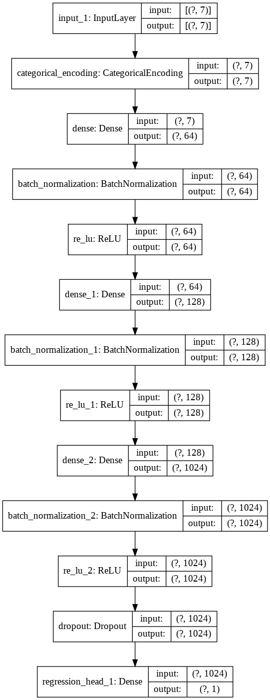

# Structured Data Regression
## A Simple Example with Auto MPG Data Set

Download [Auto MPG Data Set](https://archive.ics.uci.edu/ml/datasets/auto+mpg):
```python
import tensorflow as tf
import pandas as pd

dataset_path = "http://archive.ics.uci.edu/ml/machine-learning-databases/auto-mpg/auto-mpg.data"
raw_dataset = pd.read_csv(dataset_path, names=column_names,
                      na_values = "?", comment='\t',
                      sep=" ", skipinitialspace=True)

dataset = raw_dataset.copy()
dataset = dataset.dropna()
dataset.tail()
```

Make all but the last feature ('Origin') numerical.
```python
data_type = (len(data_cols)-1) * ['numerical'] + ['categorical']
data_type = dict(zip(data_cols, data_type))
```

```python
train_dataset = dataset.sample(frac=0.8,random_state=0)
test_dataset = dataset.drop(train_dataset.index)
train_dataset.describe()
```

```python
import autokeras as ak

regressor = ak.StructuredDataRegressor(max_trials=100, column_names=None, column_types=data_type)
regressor.fit(x=train_dataset.drop(columns=['MPG']), y=train_dataset['MPG'])
# Evaluate the accuracy of the found model.
print('Accuracy: {accuracy}'.format(
    accuracy=regressor.evaluate(x=test_dataset.drop(columns=['MPG']), y=test_dataset['MPG'])))
```
Accuracy: [9.906872749328613, 9.715665]

```python
model = regressor.export_model()
tf.keras.utils.plot_model(model, show_shapes=True, expand_nested=True)
```



## Performance Comparison to lightGBM

Not the greatest result given that a simple [lightGBM](https://lightgbm.readthedocs.io/en/latest/) model can achieve MSE score = 5.58.

```python
import lightgbm as lgb
from sklearn.metrics import mean_squared_error

train_data = lgb.Dataset(data=train_dataset.drop(columns=['MPG']), label=train_dataset['MPG'], categorical_feature=['Origin'], free_raw_data=False)

# Create an LGBM dataset from the test
test_data = lgb.Dataset(data=test_dataset.drop(columns=['MPG']), label=test_dataset['MPG'], categorical_feature=['Origin'], free_raw_data=False)

lgbm_params = {
    'boosting': 'gbdt',          # dart (drop out trees) often performs better
    'application': 'regression', # Binary classification
    #'learning_rate': 0.05,      # Learning rate, controls size of a gradient descent step
    'min_data_in_leaf': 10,      # Data set is quite small so reduce this a bit
    'feature_fraction': 0.7,     # Proportion of features in each boost, controls overfitting
    'num_leaves': 50,            # Controls size of tree since LGBM uses leaf wise splits
    'metric': 'rmse'             # Area under ROC curve as the evaulation metric
              }

evaluation_results = {}
clf = lgb.train(train_set=train_data,
                 params=lgbm_params,
                 valid_sets=[train_data, test_data], 
                 valid_names=['Train', 'Test'],
                 evals_result=evaluation_results,
                 num_boost_round=500,
                 early_stopping_rounds=100,
                 verbose_eval=20
                )
optimum_boost_rounds = clf.best_iteration

preds = np.round(clf.predict(test_dataset.drop(columns=['MPG'])))
print('MSE score = \t {}'.format(mean_squared_error(test_dataset['MPG'], preds)))
```
